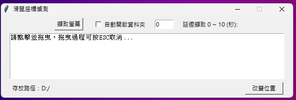

# getDesk_gui
You can use it to replace the banned Windows screenshot function.

## What offer
- Capture screenshot by selecting with the mouse.
- Customize the save directory.
- Delayed screenshot.

## How install
pip install -r requirements.txt

## Make .exe
pyinstaller --opnefile --noconsole getDesk.py

## Others
The Python version used for development is 3.12.0.
